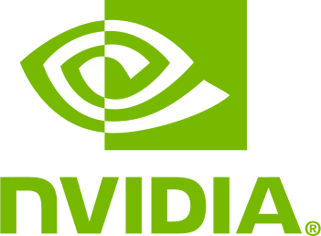

👋 I'm Michele Tessari, PhD Student on AI in CV at University of Trento and Computer Vision Engineer at BlueTensor (IT)

### Favorite Topics:
- Optimization 📉
- Computer Vision 📸
- Machine Learning 🤖
- Computer Graphics 🔺

### Languages and Tools used over the years

    

      &nbsp;
      &nbsp;
      &nbsp;
      &nbsp;
      <a href="https://github.com/django/django">&nbsp;</a>
      &nbsp;
      &nbsp;
    

  

    &nbsp;
    &nbsp;
    &nbsp;
    &nbsp;
    &nbsp;
    &nbsp;
  

  

    &nbsp;
    &nbsp;
    &nbsp;
  

  

    &nbsp;
    &nbsp;
    &nbsp;
  

  

    &nbsp;
    &nbsp;
    &nbsp;
    &nbsp;
    &nbsp;
    &nbsp;
    &nbsp;
  

  

    &nbsp;
    &nbsp;
    &nbsp;
    &nbsp;
    &nbsp;
    &nbsp;
  

### Most used languages

